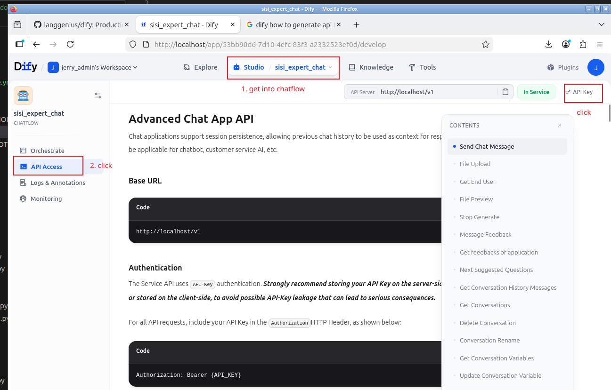
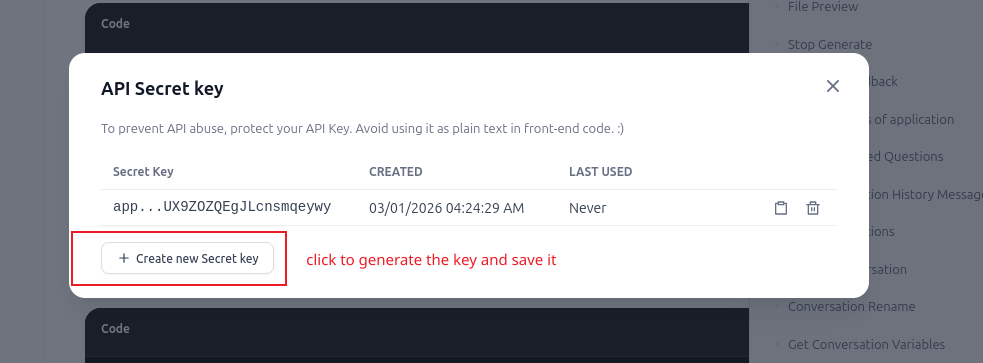
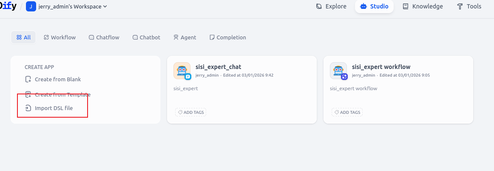
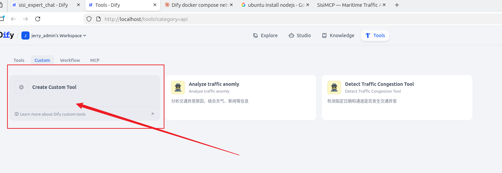
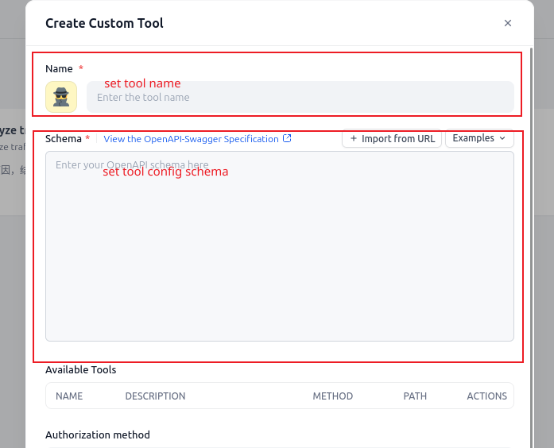
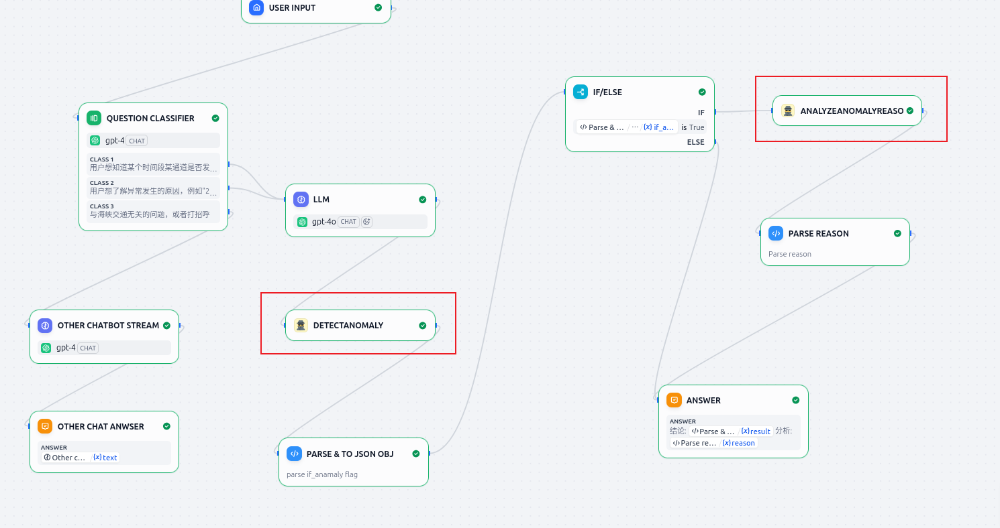
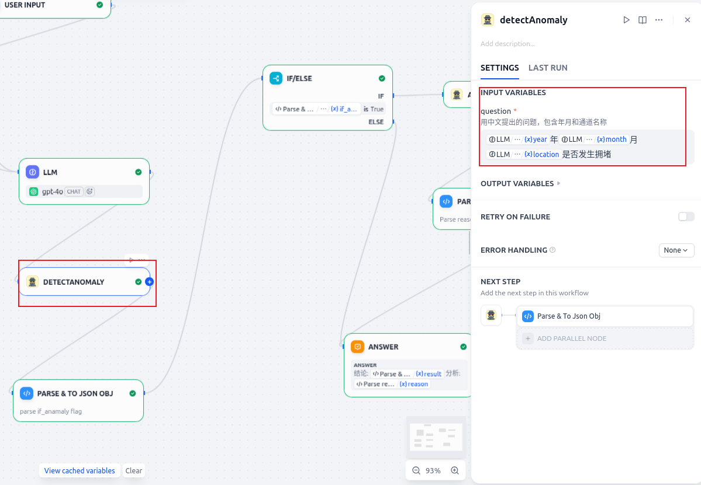
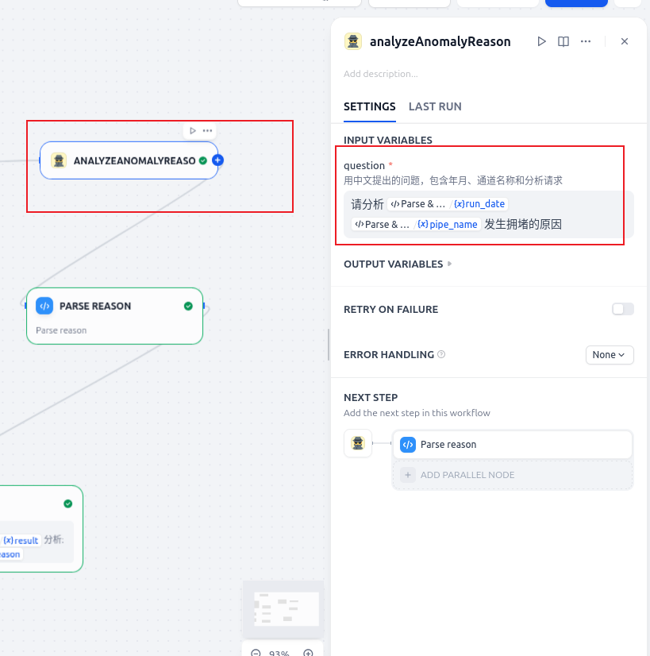

# Quick Start

## 🚀 Client Setup Checklist

Everything you need to get SISI up and running, in order.

| Step | What to do | Done? |
|------|-----------|-------|
| 1 | Install [Docker Desktop](https://www.docker.com/products/docker-desktop/) | ☐ |
| 2 | Clone & start **Dify** platform (Section 1) | ☐ |
| 3 | Generate a **Dify API key** (Section 2.1) | ☐ |
| 4 | Fill in `sisimcp/docker/.env` with your API keys (Section 2.2) | ☐ |
| 5 | Run `docker compose up -d` inside `sisimcp/docker/` (Section 2.3) | ☐ |
| 6 | Import chatflow & workflow YAML files into Dify (Section 2.4) | ☐ |
| 7 | Open **http://localhost:3000** in your browser (Section 3) | ☐ |

### Keys you will need before starting

| Key | Where to get it |
|-----|----------------|
| `DEEPSEEK_API_KEY` | [platform.deepseek.com](https://platform.deepseek.com) |
| `SISI_API_KEY` | Provided by SISI team |
| `BCI_APP_ID` / `BCI_SECRET_KEY` / `BCI_BASE_URL` | Provided by BCI team |
| `DIFY_API_KEY` | Generated inside your Dify workspace (step 2.1) |
| `DIFY_CHATFLOW_URL` | Your Dify instance URL, e.g. `http://localhost/v1` |

> **Tip:** Complete steps 1 → 7 in order. Each step depends on the previous one.

---

## 1. Set up Dify Platform

### 1.1 Clone repo

```bash
git clone https://github.com/langgenius/dify.git
git checkout -b release/e-1.11.4 origin/release/e-1.11.4
```

### 1.2 Configure environment

```bash
cd docker
cp .env.example .env
```

### 1.3 Set Docker Compose project name

Add the following line into `docker/.env`:

```
COMPOSE_PROJECT_NAME=sisi-dify-platform
```

### 1.4 Start Dify

```bash
docker compose up -d
```

---

## 2. Set up MCP & Backend API Services

### 2.1 Generate Dify API token

Navigate to your Dify workspace → **API Keys** and generate a new key.




### 2.2 Configure environment variables

```bash
cd sisimcp/docker
cp .env.example .env
# Edit .env and fill in the required tokens
```

Required variables:

| Variable | Description |
|---|---|
| `DEEPSEEK_API_KEY` | DeepSeek API key |
| `SISI_API_KEY` | SISI AI API key |
| `BCI_APP_ID` | BCI app ID |
| `BCI_SECRET_KEY` | BCI secret key |
| `BCI_BASE_URL` | BCI base URL |
| `DIFY_API_KEY` | Dify API key (generated in step 2.1) |
| `DIFY_CHATFLOW_URL` | Dify chatflow endpoint URL |

### 2.3 Start all services (MCP + Dify API + Frontend)

```bash
cd sisimcp/docker
docker compose up -d
```

This starts three containers:

| Container | Port | Description |
|---|---|---|
| `sisimcp-mcp-server` | 8000 | MCP HTTP server |
| `sisimcp-dify-api` | 8002 | Dify integration API |
| `sisimcp-frontend-nextjs` | 3000 | Next.js web frontend |

### 2.4 Import Dify chatflow & workflow & custom tools

#### 2.4.1 Import apps



- Import `mcp_conductor/resources/dify/sisi_expert_chat.yml` as a **Chatflow**
- Import `mcp_conductor/resources/dify/sisi_expert_workflow.yml` as a **Workflow**

#### 2.4.2 Register custom tools




Tool config files are located under `mcp_conductor/resources/dify/`.

#### 2.4.3 Troubleshooting: custom tool nodes lose input parameters

In this version of Dify, custom tool nodes may lose their input parameter settings after import. If this happens:

1. Delete the affected custom tool nodes

   

2. Re-create the nodes

   

3. Re-configure `detectAnomaly` node

   

4. Re-configure `analyzeAnomalyReason` node

   

---

## 3. Access the Frontend

Open your browser and navigate to:

**http://localhost:3000**

### Pages

| URL | Description |
|---|---|
| `/chatbot` | Chat with SISI Expert via Dify chatflow |
| `/workflow` | Workflow Inspector — view agent call logs and ship count chart |

### Workflow Inspector features

- **通航船数量 chart** — interactive area chart of ship counts per channel (`ship_cnt_in_pipe` table)
- **海峡 selector** — switch between channels (马六甲海峡, 曼德海峡, etc.)
- **Time window buttons** — quickly select 1M / 3M / 6M / 1Y / All
- **Date range pickers** — set a custom start and end date
- **Anomaly markers** — red dots on the chart for dates flagged as anomalous (detection_flag = 红)
- **Agent call log cards** — paginated list of DeepSeek agent call history with reasoning

---

## 4. Local Development (optional)

If you want to run the Next.js frontend outside of Docker for development:

```bash
cd sisimcp/frontend_nextjs
cp .env.local.example .env.local
# Edit .env.local and fill in DIFY_API_KEY, DIFY_CHATFLOW_URL, SQLITE_DB_PATH

npm install
npm run dev
```

> **Note:** `SQLITE_DB_PATH` should point to the local SQLite file, e.g. `../data/sisi.sqlite`.

---

## 5. Rebuilding Docker Containers

After making code changes, rebuild and restart:

```bash
cd sisimcp/docker

# Rebuild a single service
docker compose build --no-cache frontend_nextjs
docker compose up -d frontend_nextjs

# Rebuild everything from scratch
docker compose down
docker compose build --no-cache
docker compose up -d

# View logs
docker compose logs -f frontend_nextjs

# Check running containers
docker compose ps
```

> **Important:** Never copy `node_modules` or `.next` from the host into the Docker image.
> The `.dockerignore` at the project root excludes them intentionally, so that `better-sqlite3`
> (a native Node.js addon) is compiled inside the Linux container rather than using
> Windows-compiled binaries from the host.